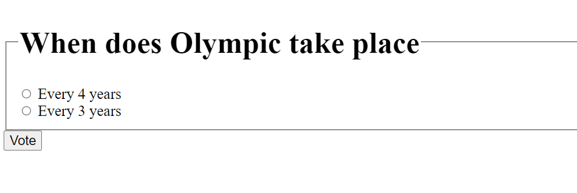

# Django-webpoll

## Setup

The first thing to do is to clone the repository:

```sh
$ https://github.com/dasbairagya/Django-webpoll.git
$ cd Django-webpoll
```

Create a virtual environment to install dependencies in and activate it:

```sh
$ virtualenv2 --no-site-packages env
$ source env/bin/activate
```

Then install the dependencies:

```sh
(env)$ pip install -r requirements.txt
```
Note the `(env)` in front of the prompt. This indicates that this terminal
session operates in a virtual environment set up by `virtualenv2`.

Once `pip` has finished downloading the dependencies:
```sh
(env)$ cd project
(env)$ python manage.py runserver
```


## Walkthrough
Navigate to `http://127.0.0.1:8000/polls/` and
`http://127.0.0.1:8000/polls/`
username and password both is `admin`





## Tests

To run the tests, `cd` into the directory where `manage.py` is:
```sh
(env)$ python manage.py test polls
```
